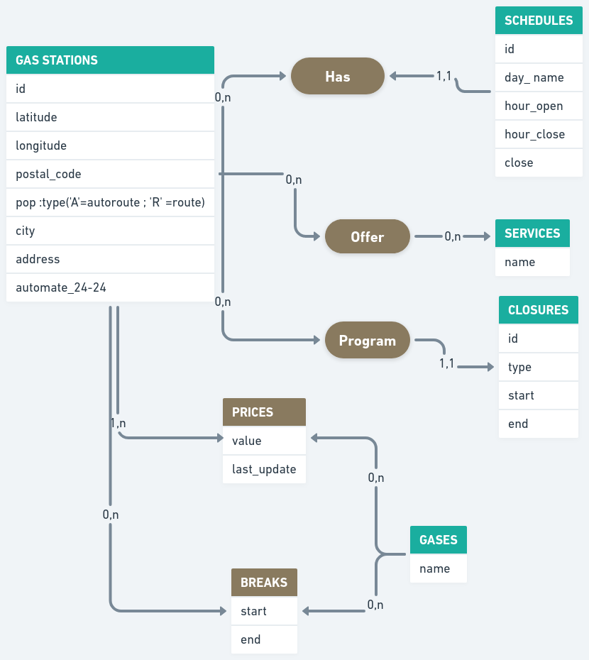

# BDD

## De manière général :

- **Qu’est ce qu’un SGBD ?**
    -  Le **SGBD** est un système de gestion de base de donnés. C'est le logiciel quipermet à un ordinateur de stocker, récupérer, ajouter, supprimer et modifier des données.
- **Qu’est-ce qu’un système d’information ?**
    - Le **système d'information (SI)** est un ensemble de ressources et de dispositifs permettant de collecter, stocker, traiter et diffuser les informations nécessaires au fonctionnement d'une organisation
- **Qu’est-ce qu’une base de données ?**
    - Une **base de données (BDD)** est un ensemble d'informations qui est organisé de manière à être facilement accessible, géré et mis à jour. Elle est utilisée par les organisations comme méthode de stockage, de gestion et de récupération de l'informations.
- **Citez les différences entre ces éléments.**
    - En résumé, un **SGBD** est un logiciel utilisé pour gérer les bases de données, un **système d'information** est un ensemble de ressources qui inclut souvent des bases de données, et une **base de données** est un ensemble organisé de données.

## Pour un MCD (Modèle Conceptuel de Données) :
- **Qu’est ce qu’un MCD et pourquoi est-ce que cela existe ?**
    - Le **MCD** est un outil essentiel dans la modélisation et la conception des systèmes d'information. Il permet de représenter les entités, les relations et les règles de gestion d'un système d'une manière claire, ce qui facilite la communication, la compréhension, la conception et la maintenance de la base de données.
- **Comment représenter une entité ?**
    - Pour représenter une entité dans un modèle conceptuel de données (MCD), on utilise généralement un **diagramme entité-association (DEA)** qui fournit une visualisation graphique des entités et de leurs relations.
- **Comment représenter une liaison entre des entités ?**
    - La représentation d'un lien entre les entités est l'utilisation de connecteurs, de cardinalités et de rôles permettant de décrire clairement la relation entre les entités. Cette représentation aide à comprendre les associations et les interactions entre les différentes parties du système d'information.
- **Où mettre les données qui composent nos entités ?**
    - Les entités d'un système d'information sont généralement représentées par des tables dans une base de données relationnelle. Chaque table correspond à une entité et contient des enregistrements qui représentent les instances individuelles de cette entité. Les attributs de l'entité sont représentés par des colonnes dans la table.
- **Quels sont les différents types de cardinalité possibles ? Où les placer dans notre schéma ?**
    - Les différents types de cardinalité sont la cardinalité **one to one (1:1)**, il s'agit d'une relation où une occurrence d'une entité est associée à une et une seule occurrence d'une autre entité, et vice versa. **One to many (1:N)**, c'est une relation où une occurrence d'une entité est associée à plusieurs occurrences d'une autre entité, mais chaque occurrence de cette autre entité est associée à une seule occurrence de la première entité. **Many to many (N:N)**, il s'agit d'une relation où plusieurs occurrences d'une entité peuvent être associées à plusieurs occurrences d'une autre entité. Ils sont généralement placés près des extrémités des connecteurs dans le schéma pour indiquer le nombre d'occurrences possibles dans la relation.
- **Citer quelques bonnes pratiques de normalisation.**
    1. **Respecter les formes normales** : Les formes normales, telles que la première forme normale (1NF), la deuxième forme normale (2NF) et la troisième forme normale (3NF), fournissent des directives pour structurer les tables de manière à éliminer les dépendances et les redondances inutiles. Respecter ces formes normales contribue à garantir la cohérence et la qualité des données.

    2. **Identifier les dépendances fonctionnelles** : Identifiez les dépendances fonctionnelles entre les attributs d'une table. Une dépendance fonctionnelle se produit lorsqu'un attribut dépend d'un autre attribut. L'élimination des dépendances fonctionnelles inutiles permet de réduire les redondances et d'améliorer la flexibilité de la base de données.

    3. **Diviser les tables en entités distinctes** : Divisez les tables en entités distinctes, de sorte que chaque table ne représente qu'une seule entité. Cela permet d'organiser les données de manière logique et d'éviter les duplications d'informations.

    4. **Utiliser des clés primaires appropriées**: Choisissez judicieusement les clés primaires pour chaque table. Une clé primaire doit être unique et stable, c'est-à-dire qu'elle ne change pas fréquemment. Utilisez des clés primaires simples et significatives pour identifier de manière unique chaque enregistrement.

    5. **Établir des relations via des clés étrangères** : Utilisez des clés étrangères pour établir des relations entre les tables. Les clés étrangères garantissent l'intégrité référentielle et permettent de maintenir la cohérence des données entre les tables.

    6. **Éviter les redondances de données** : Évitez les redondances de données en stockant chaque donnée à un seul endroit. Si une donnée est répétée dans plusieurs endroits, cela peut entraîner des incohérences et des difficultés lors de la mise à jour des données.

    7. **Normaliser les attributs multivalués**: Si vous avez des attributs multivalués dans une table, considérez la possibilité de les normaliser en les déplaçant vers des tables distinctes avec des relations appropriées. Cela permet de simplifier la structure de la base de données et de réduire les redondances.

    8. **Assurer la cohérence des données** : Veillez à ce que les règles d'intégrité référentielle soient respectées. Utilisez des contraintes de clé étrangère pour garantir que les relations entre les tables sont cohérentes et que les modifications ou suppressions d'enregistrements ne conduisent pas à des incohérences.

- **A quoi servent les clés primaires ?**
    - Les clés primaires sont utilisées pour identifier de manière unique chaque enregistrement dans une table, garantir l'intégrité référentielle, améliorer les performances des requêtes, appliquer des contraintes d'intégrité et faciliter les opérations de jointure, de modification et de suppression des données. Elles jouent un rôle crucial dans la structuration, la gestion et l'exploitation efficace des données dans une base de données relationnelle.

## Pour un MLD (Modèle Logique de Données) :
- **Comment passer d'un MCD au MLD ? Que deviennent les associations ?**
    - Pour passer d'un Modèle Conceptuel de Données (MCD) à un Modèle Logique de Données (MLD), il est nécessaire de traduire les entités, les associations et les attributs du MCD en tables, relations et attributs dans le MLD. Les associations dans le MCD sont transformées en clés étrangères dans le MLD pour représenter les relations entre les tables. 

## 1.2 — Mise en pratique MCD et MLD

## MCD

## MCD

## 1.3 — Mise en pratique avec le dataset du module : le prix des
stations essence

## MCD

## MCD

## 2.1 — Initiation au SQL 1h — Présentiel
À l’aide des ressources, complétez votre fichier mémo avec la réponse à ces questions :
- **Comment créer une base de données ?**
  - Il faut choisir un système de gestion de base de données (SGBD). Puis le processus de création peut varier
  en fonction du SGBD que vous utilisez, mais généralement, vous pouvez utiliser une interface graphique
  (par exemple, phpMyAdmin pour MySQL) ou une ligne de commande (par exemple, SQL CREATE DATABASE). 
- **Comment faire un commentaire ?**
  - Dans le SQL avec "--" puis le texte.
- **Comment créer une table et des colonnes ?**
  - Pour créer une table et des colonnes, on utilise la commande CREATE TABLE puis le nom de la table,
  par la suite entre les parentheses, on spécifie le nom de la colonne et le type de donnée et on les sépare par de virgules.
- **Listez les types de données que vous utiliserez le plus souvent.**
  - INT (chiffre entier), FLOAT (chiffre décimaux), CHAR ou VARCHAR (chaîne de caractères de longueur fixe),
  DATE (date en format AAAA-MM-DD), DATETIME ou TIMESTAMP (date et une heure spécifiques), BOOLEAN (valeur 0 ou 1)...
- **Listez des contraintes utiles pour vos colonnes :**
  - **comment préciser qu'une valeur est obligatoire pour une colonne ?**
    - On utilise la contrainte NOT NULL.
  - **comment définir l'id d'une table ?**
    - On utilise la clause PRIMARY KEY.
- **Comment préciser que la valeur d'une colonne doit être unique ?(pour une adresse email par
  exemple)**
  -  On utilise la clause UNIQUE.
- **Comment insérer des données dans une table ?**
- on utilise la commande SQL INSERT INTO puis le nom de la table, ensuite entre parenthèses les colonnes,
ensuite VALUES et entre parenthèses la valeur de chaque colonne
- **Comment récupérer les données insérées ?**
  - On utilise la commande SQL SELECT puis *.
- **Comment ne sélectionner qu'un certain nombre de résultats ?**
  - On utilise la commande SQL SELECT puis la colonne, ensuite FROM et le nom de la table.
- **Comment trier les résultats ?**
  - On utilise la clause ORDER BY puis le nom de la colonne et ASC (ordre croissant) et DESC (décroissant).
- **Comment filtrer les données et chaîner les conditions de filtres ?**
  - On utilise la clause WHERE et les opérateurs logiques AND et OR.
- **Comment filtrer une colonne avec une valeur commençant par un certain caractère ?**
  - On utilise la clause WHERE puis la colonne, ensuite LIKE puis entre guillemets % et le caractère.
- **A quoi servent les INDEX ? Comment en créer ?**
  - Les INDEX sont utilisés en SQL pour améliorer les performances des requêtes en accélérant
  la recherche et la récupération de données dans une table.
  - Pour créer un INDEX, on utilise la commande SQL CREATE INDEX
puis le nom de l'index ON puis le nom de la table et entre parentheses les colonnes.
- **Comment créer une relation entre 2 tables ?**
  - On utilise les clés étrangères (foreign keys). Pour la specifier :
  FOREIGN KEY (nom_colonne_dans_la_table) REFERENCES nom_de_la_table(id),
- **Comment sélectionner les données de plusieurs tables ?**
  - On utilise la clause JOIN qui permet de combiner les enregistrements de deux ou plusieurs tables
  en fonction d'une condition de jointure spécifiée.
    Il existe différents types de jointures que l'on peut utiliser, notamment INNER JOIN,
  LEFT JOIN, RIGHT JOIN, et FULL JOIN, selon la logique de combinaison souhaitée entre les tables.
- **Comment ne sélectionner que certaines colonnes et les renommer dans la liste de résultats ?**
  - On utilise la clause SELECT avec l'alias de la colonne qui permet de donner un nom alternatif
  à une colonne dans les résultats de la requête.
- **Comment supprimer une table et une base de données ?**
  - On utilise la commande DROP TABLE puis le nom de la table ou
  DROP DATABASE et le nom de la base de données.

## SQLite
**SQLite** est une bibliothèque logicielle open source qui offre un système de gestion de base de données relationnelles
(RDBMS) sans serveur. Contrairement à d'autres systèmes de gestion de base de données tels que MySQL ou PostgreSQL, 
SQLite ne fonctionne pas en tant que serveur de base de données autonome nécessitant une installation et 
une configuration distinctes. Au lieu de cela, SQLite est implémenté en tant que bibliothèque liée dynamiquement qui 
peut être intégrée directement dans des applications et des systèmes.

SQLite se distingue par sa légèreté et sa rapidité, ce qui le rend adapté aux applications et aux appareils ayant
des ressources limitées. Il est écrit en langage C et offre un large éventail de fonctionnalités de base de données. 
SQLite stocke les données dans un fichier unique, ce qui facilite la portabilité et la sauvegarde des bases de données. 
Il prend en charge le langage SQL standard, permet la création de tables, l'insertion, la mise à jour et la suppression 
de données, ainsi que des fonctionnalités avancées telles que les jointures, les transactions ACID 
(Atomicité, Cohérence, Isolation, Durabilité), les index et les déclencheurs.

En raison de sa simplicité et de sa portabilité, SQLite est largement utilisé dans une variété d'applications, 
y compris les systèmes embarqués, les applications mobiles, les navigateurs web, les logiciels de bureau et bien d'autres.

## Les différents SGBD

1. **Key-value Databases** (Redis & Memcached)
  - *TRADEOFF* : FAST / NO QUERIES
  - *BEST FOR* : caching, PUB/SUB & LEADERBOARDS
2. **Wide Column** (Cassandra, Apache HBase)
   - *TRADEOFF* : SCHEMA-LESS / WITHOUT JOINS 
   - *BEST FOR* : time-series, historical records & high-write, low-read 
3. **Document Databases** (MongoDB, Firestore, CouchDB)
   - *TRADEOFF* : SCHEMA-LESS / RELATIONAL-ISH QUERIES / WITHOUT JOINS
   - *BEST FOR* : most apps, games & IOT
   - *NOT IDEAL FOR* : Graphs
4. **Relational Databases** (MySQL, Postgres, SQL Server, CockroachDB)
   - *BEST FOR* : most apps
   - *NOT IDEAL FOR* : Unstructured data
5. **Graph Databases** (Neo4j, DGraph, Janus Graph)
   - *BEST FOR* : Graphs, knowledge graphs & recommendation engines
6. **Search Databases** (ElasticSearch, Algolia, MeiliSearch)
  - *BEST FOR* : search engines & typeahead
7. **Multi-model Databases** (FaunaDB, CosmosDB)
   - *BEST FOR* : everything
